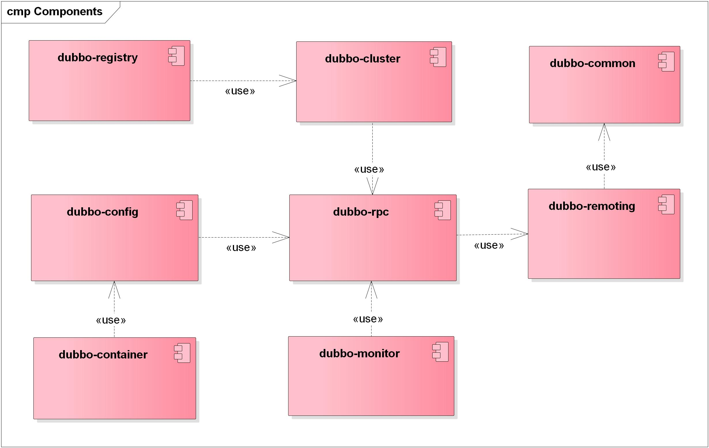
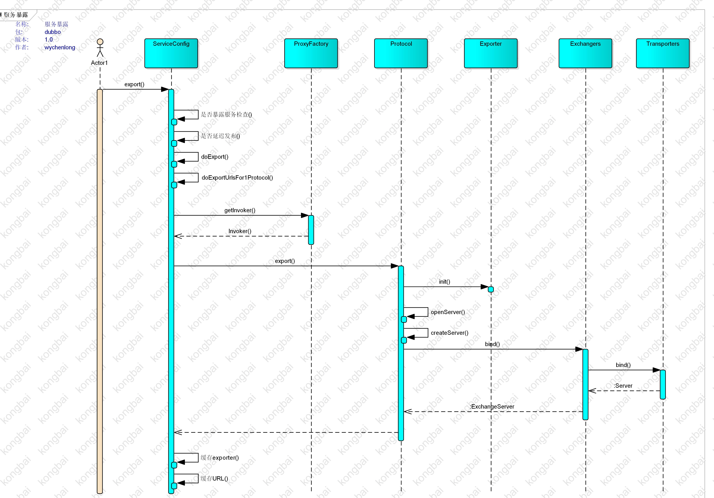

# 1、架构设计
## 1.1 架构图
+ 
+ 调用关系说明:
  + 1、服务容器加载运行服务提供者
  + 2、服务提供者向注册中心注册自己提供的服务
  + 3、服务消费者在启动时订阅自己关心的服务
  + 4、注册中心返回服务提供者列表，若服务提供者有变化则负责通知消费者
  + 5、服务消费者通过软负载均衡算法从服务提供者列表选一台提供者进行调用，调用失败在选另外一台进行调用
  + 6、服务提供者、服务消费者负责统计服务调用次数、服务调用时间等信息汇报给监控中心，监控中心报表展示
+  Dubbo提供的特性保证
  + 可用性
  + 可伸缩
  + 升级
+ 

## 1.2 框架设计
+ 

## 1.3 模块组件
+ 

## 1.4 设计思想
  + 1、从框架图可以清晰的看出Dubbo主要采用的是层次架构，划分不同的业务层次，直到系统最低层次序列化层，每个层次的职责清晰。
  + 2、从模块组件可以看出层次之间单向依赖关系。
  + 3、从领域驱动战略模式来看Dubbo，所有问题域RPC、负载、监控、SPI、公共组件
  + 4、设计原则
    + 1、层次架构：将系统划分不同的业务层次，直到系统最低层次序列化层
    + 2、抽象能力：抽象业务领域的能力，抽象基础组件比如抽取dubbo-common
    + 3、分离关注点：如何确定每个层次的组件模块，组件内的高频动作聚合在组件内部，组件间作用是低频动作
    + 4、高内聚
    + 5、松耦合
## 1.5 分层的设计原则
## 1.6 分包的设计原则

# 2 实现细节
## 2.1 配置解析

## 2.2 服务发布解析
+ 
+ 主要流程步骤
  + 1、spring容器加载配置文件，回调DUBBO命名空间解析器，初始化各个配置类
  + 2、调用ServiceConfig export()方法，该方法为同步方法；判断是否延迟发布若为延迟则单独启动一个线程休眠再调用doExport，否则直接调用doExport
    + 1）volatile+synchronized 防止二次发布
    + 2）默认配置检查provider为空则创建ProviderConfig，并且初始化相关属性配置
    + 3）判断服务接口类型是否是通用服务接口，若是则直接初始化接口类型，若不是则动态加载该接口类型；（为什么是ContextClassLoader）
    + 4）是否为本地发布
    + 5) 是否有存根服务
    + 6）检查应用信息、注册信息、协议信息、订阅MOCK信息
  + 3、doExportUrls，将服务发布多个协议之中，doExportUrlsFor1Protocol发布服务到具体协议之中
    + 1)加载注册中心，SPI机制
    + 2）组织注册中心URL
      + registry://127.0.0.1:2181/org.apache.dubbo.registry.RegistryService?application=demo-provider&dubbo=2.0.2&pid=15244&qos.port=22222&registry=zookeeper&timestamp=1544768530777
      
  + 4、doExportUrlsFor1Protocol真正服务暴露逻辑如下：
    + 1）是否有注册中心，有的话测试连通性
    + 2）首先获取协议配置的端口，若端口为空或者为0，则获取提供者配置的端口；若端口还为空或者为0，则取协议的默认端口；
    + 3）若此时端口还为空或者小于0，则随机端口
    + 4）组织参数，生成URL
      + dubbo://10.9.10.34:29581/com.alibaba.dubbo.config.api.DemoService?anyhost=true&application=generic-provider&dubbo=2.0.0&generic=true&interface=com.alibaba.dubbo.config.api.DemoService&methods=*&pid=9400&side=provider&timestamp=1539678089461
      + dubbo://10.9.10.34:20880/com.alibaba.dubbo.config.api.DemoService?anyhost=true&application=test-protocol-random-port&dubbo=2.0.0&generic=false&interface=com.alibaba.dubbo.config.api.DemoService&methods=sayName,getBox,throwDemoException,echo,getUsers&pid=12896&side=provider&timestamp=1539778311574
    + 5) 判断暴露服务范围（本地、远程）决定本地暴露还是远程暴露
    + 6）URL转换组织
    + 7）通过代理工厂获取Invoker对象
    + 8) 通过对应的协议调用服务发布方法进行服务暴露

+ 本地发布过程 
    + 本质是通过代理类直接调用接口方法，执行本地调用
    + URL转换为本地
       + injvm://127.0.0.1/com.alibaba.dubbo.config.api.DemoService?anyhost=true&application=generic-provider&dubbo=2.0.0&generic=true&interface=com.alibaba.dubbo.config.api.DemoService&methods=*&pid=23048&side=provider&timestamp=1539691985449
       

+ 远程发布
 + 注册中心URL
  + registry://127.0.0.1:2181/com.alibaba.dubbo.registry.RegistryService?application=test-protocol-random-port&dubbo=2.0.0&pid=12396&registry=zookeeper&timestamp=1540696101732
 + 服务URL
  + dubbo://10.9.10.34:20880/com.alibaba.dubbo.config.api.DemoService?anyhost=true&application=test-protocol-random-port&dubbo=2.0.0&generic=false&interface=com.alibaba.dubbo.config.api.DemoService&methods=sayName,getBox,throwDemoException,echo,getUsers&pid=12396&scope=remote&side=provider&timestamp=1540696261298
  + 打印的日志
  
+ 问题
  + 没有注册中心，是在本地发布INJVM？
  + 多网卡，服务如何发布？
  + 网络IO接收的线程模型和协议里面的连接池配置关系？
  + URL是什么？ URL - Uniform Resource Locator 
  + 代理工厂作用什么？有哪些类型？
  + 代理工厂如何转换URL为INVOKER？INVOKER又是什么，作用是什么？
     直接新建一个AbstractProxyInvoker，该类持有URL信息
  + 一个接口里有若干方法，如何发布方法的？
  + 多个接口进行服务发布的时候会多次调用openserver吗？
  + RPC模型？
  + 如何在注册中心发布
复杂：分而治之，拆分为多个独立的小程序，然后再统一接口进行组织
## 2.3 服务调用解析
## 2.4 远程通讯解析
## 2.5 线程模型解析
## 2.6 异步调用解析

# 3 SPI 扩展点实现

# 4 服务治理

服务治理的一些关键活动包括：
+ 1、服务发布、服务发现、服务版本管理、服务管理控制：审批、授权、黑白名单
+ 2、服务平滑升级、服务集群弹性伸缩
+ 3、服务路由，负载均衡
+ 4、服务熔断机制、服务降级、服务限流
+ 5、服务监控，通过监控服务的性能和可用性，当问题出现的时候能马上采取应对措施。
+ 6、服务编排，管理由谁来调用服务、怎样调用服务

# 问题
+ 注册中心挂掉，服务如何调用
+ 增加注册中心，服务如何被自动发现
+ 通过IP段判断与本机同机房的注册中心， 如果同机房的服务提供者可用，优先访问， 否则，再访问其它机房的服务提供者

# 参考文献
+ 官方文档
  + http://dubbo.io/books/dubbo-user-book/preface/architecture.html
+ https://dubbo.gitbooks.io/dubbo-dev-book/content/implementation.html
+ https://yq.aliyun.com/articles/58510?spm=5176.100239.blogcont58510.9.JWtBlb#3
+ https://yq.aliyun.com/articles/58511
## 服务治理
+ http://javatar.iteye.com/blog/1345073
+ http://blog.kazaff.me/2015/02/02/dubbo%E7%9A%84%E6%9C%8D%E5%8A%A1%E6%B2%BB%E7%90%86%E7%BB%86%E8%8A%82/
## 微服务
+ https://skyao.gitbooks.io/learning-microservice/content/design/javacodegeeks/microservice-design-patterns.html
+ http://www.infoq.com/cn/news/2015/04/micro-service-architecture?p13nId=&p13nType=#
+ http://www.dayatang.org/oo-principles/value-principle-pattern-and-practice.html
+ http://blog.cuicc.com/blog/2015/07/22/microservices/
+ http://www.uml.org.cn/mxdx/200912233.asp

# 区块链
+ https://yeasy.gitbooks.io/blockchain_guide/content/born/what.html

# 架构学习篇
http://www.dayatang.org/oo-principles/rep.html
http://www.dayatang.org/oo-principles/value-principle-pattern-and-practice.html
http://www.uml.org.cn/mxdx/200912233.asp
http://javatar.iteye.com/blog/93469

http://yiduwangkai.iteye.com/blog/2321896
http://www.cnblogs.com/chencheng/archive/2012/07/05/2575406.html
http://www.infoq.com/cn/articles/several-pain-points-architecture-design
http://yiduwangkai.iteye.com/blog/2321896

7种微服务反模式
http://www.infoq.com/cn/articles/seven-uservices-antipatterns

http://www.uml.org.cn/zjjs/201705272.asp
http://mp.weixin.qq.com/s?__biz=MzIzOTU0NTQ0MA==&mid=2247487105&idx=1&sn=80e8df54282f759496c7d9a419656b88&chksm=e929338ede5eba98f476aaad1ba3026f08503b6e84b65608129490b27834688ad3b7c2f84a10&mpshare=1&scene=24&srcid=0327W2jtR2XGo8crfcFxzTWL#rd

https://wizardforcel.gitbooks.io/design-pattern-lessons/content/lesson6.html

https://www.cnblogs.com/daoqidelv/p/7499244.html
http://www.uml.org.cn/mxdx/201401223.asp
https://www.zhihu.com/org/thoughtworks-zhong-guo/posts

https://cn.aliyun.com/jiaocheng/546290.html
https://www.zhihu.com/question/61484424
http://java-performance.com/
https://tech.meituan.com/innodb-lock.html?utm_source=tool.lu